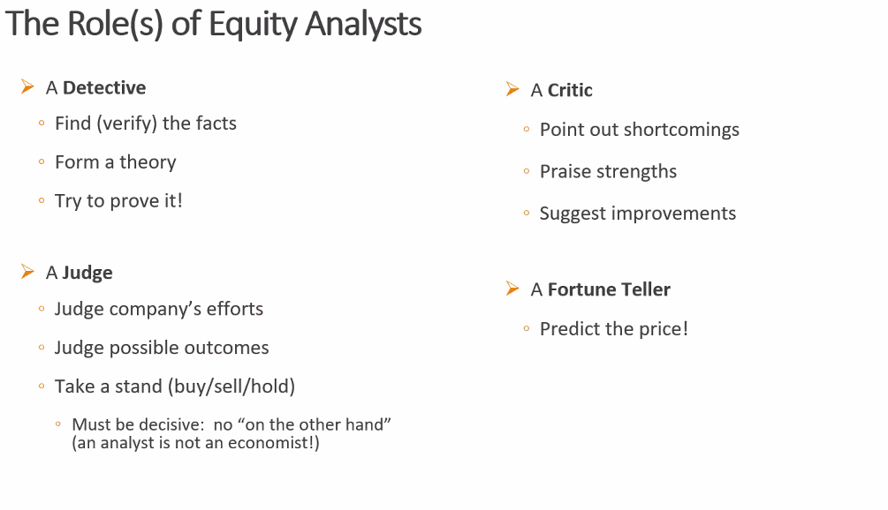
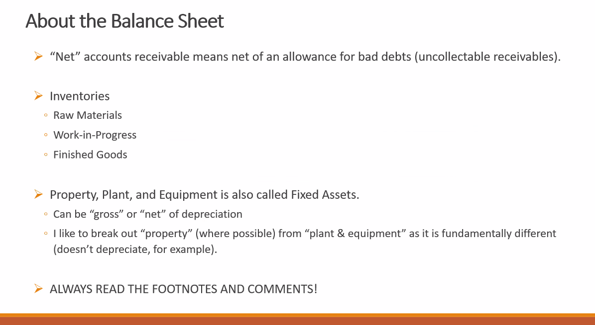
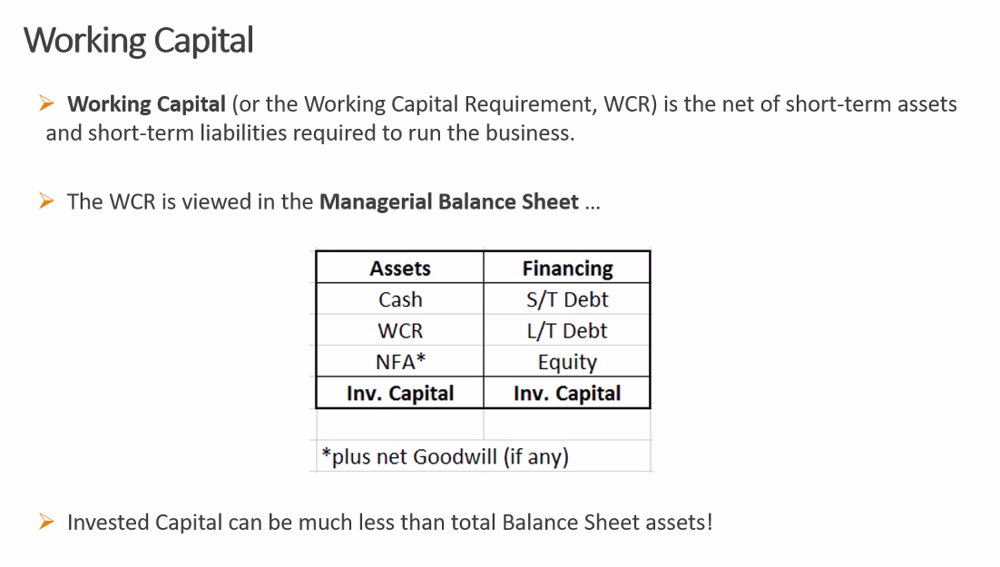
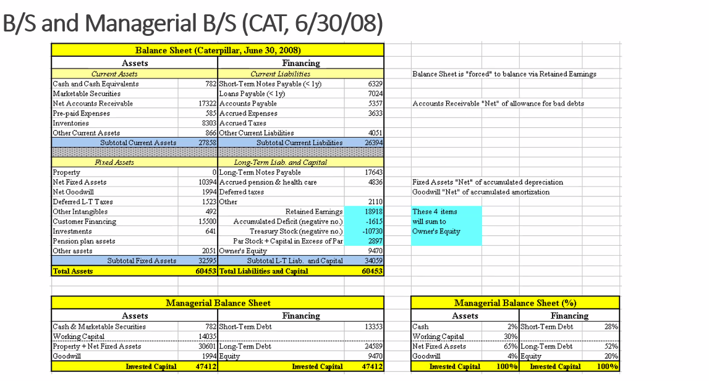
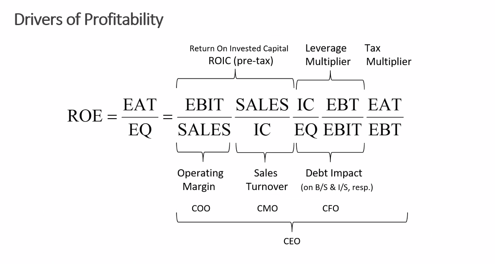
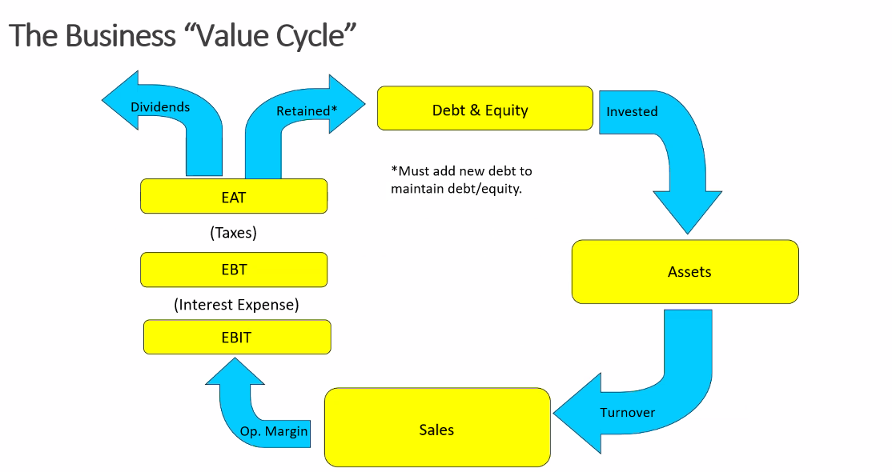
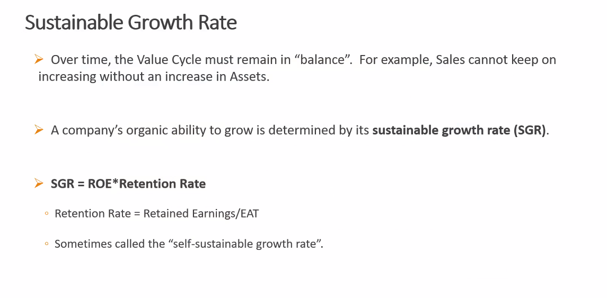
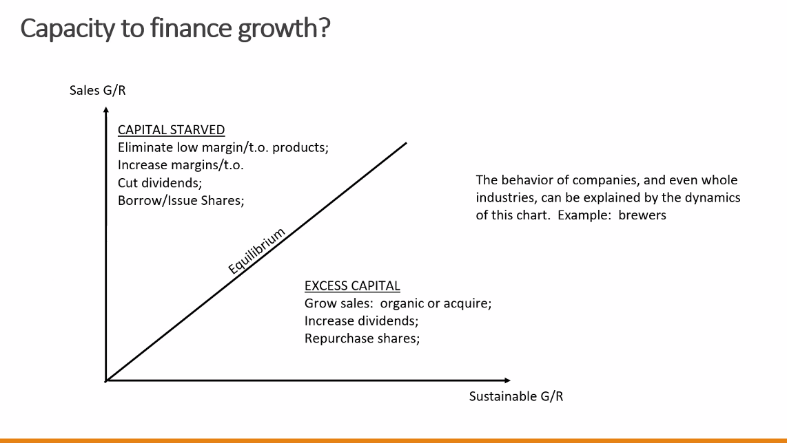
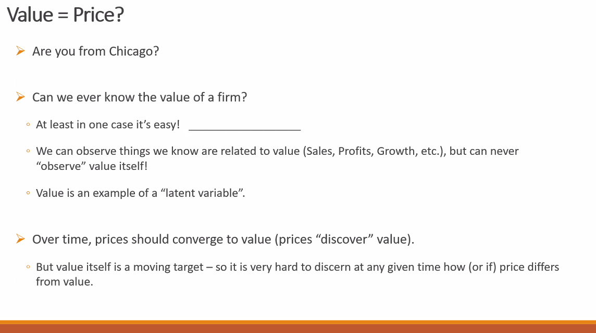
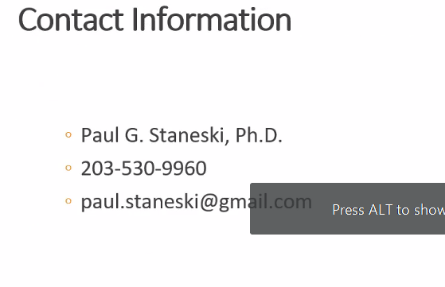

- predict prices 

### Blaance sheet

- 

- Cash is unaccounted assest - not good thing to keep too much cash 

- Working Capital

3 things to look at BS: 
- look at BS for past 3-5 years: percentage should stay about same 
- working capital rising , finance cost rising should be concern 
- compare with peers or competetors 
- short term assest with ST financuing and Long term assest with long term financing 
- when you buy house you dont pay by credit card but go for long term options 
- 

- general modus operandi for private equity is they buy public company or another pvt company 
- hen they take it private 
- goal is to make is more efficient and sell it 
- what can be done is working capital improvement to build a better company in longer term
- https://www.investopedia.com/terms/l/leveragedbuyout.asp

### drivers of profitability

IC: invested capital 
EQ: Equity
EBIT: Earning before intererest and tax
EBT: Earning before tax

